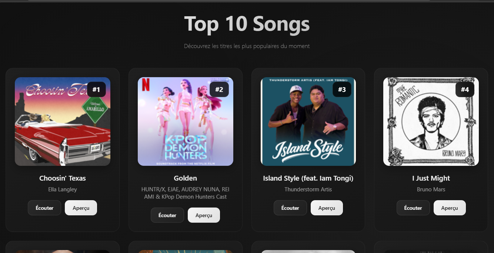
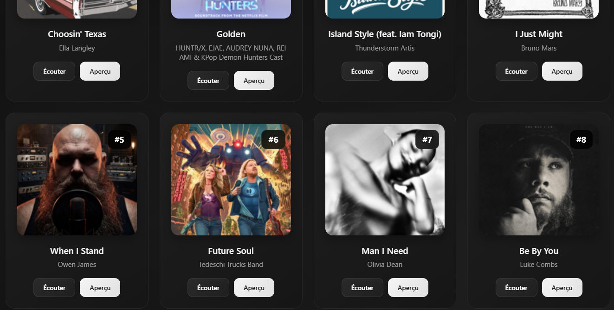
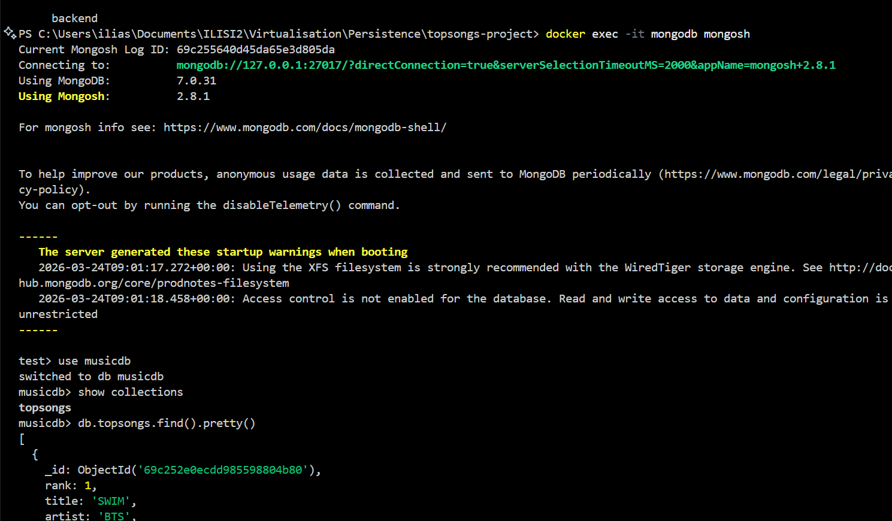

## TopSongs Project

A small full-stack app that displays the iTunes **Top 10 Songs**.  
The frontend fetches data from the backend, which seeds MongoDB from the iTunes RSS feed.

## Screeshots From the project
[](docs/images/image1.png)
[](docs/images/image2.png)


## Architecture

- `frontend/`: Nginx + `index.html` (static UI). It calls `GET /api/songs`.
- `backend/`: Node.js + Express API. It exposes `GET /songs` and seeds MongoDB on startup by fetching the iTunes RSS feed.
- MongoDB: stores the seeded songs.

## Endpoints

- `GET /api/songs` (frontend/Nginx): returns the song list to the browser.
- `GET /songs` (backend): same data, served directly by the API.

Song fields returned:

- `rank`, `title`, `artist`, `image`, `songLink`, `previewLink`, `createdAt`

## Run with Docker (recommended)

### Prerequisites

- Docker installed and running

### Why container names matter

The code hardcodes these hostnames:

- `backend/server.js` uses `mongodb://mongodb:27017`
- `frontend/nginx.conf` proxies to `http://backend:3000/songs`

So you must run containers named `mongodb` and `backend` on the same Docker network.

### Commands (PowerShell)

From the repo root (`topsongs-project`):

1. Create a Docker network:
   ```powershell
   docker network create topsongs-net
   ```

2. Build images:
   ```powershell
   docker build -t topsongs-frontend ./frontend
   docker build -t topsongs-backend ./backend
   ```

3. Start MongoDB:
   ```powershell
   docker run -d --name mongodb --network topsongs-net mongo:7
   ```

4. Start the backend:
   ```powershell
   docker run -d --name backend --network topsongs-net topsongs-backend
   ```

   Note: the backend seeds songs on startup and retries MongoDB connection (up to ~30s total).

5. Start the frontend:
   ```powershell
   docker run -d --name frontend --network topsongs-net -p 8080:80 topsongs-frontend
   ```

6. Open:
   - `http://localhost:8080`

## Folder Structure

- `frontend/`
  - `index.html`: UI + `fetch("/api/songs")`
  - `nginx.conf`: routes `/api/songs` to the backend container
  - `Dockerfile`: builds the Nginx image
- `backend/`
  - `server.js`: Express API + iTunes RSS seeding into MongoDB
  - `package.json`: dependencies (`express`, `mongodb`, `axios`, `xml2js`)
  - `Dockerfile`: builds the Node image

## Notes / Troubleshooting

- If you see “Aucune chanson trouvée.” in the UI, the backend likely failed to seed MongoDB (for example, no outbound access to the iTunes RSS URL).
- The backend always deletes and re-inserts the `topsongs` collection during seeding (`deleteMany({})`), so the list refreshes on each container start.
- If `docker run` / `docker pull` fails (for example with messages like “Docker Desktop has no HTTPS proxy”), you likely need to configure a corporate proxy for Docker:
  - Open Docker Desktop -> `Settings` -> `Proxies`
  - Set `HTTP/HTTPS proxy` (and credentials if required)
  - Restart Docker Desktop

## View The Data Stored In MongoDb

- In order to see the data that are stored in your database, you have to execute this commands

1. Docker Ps:
   ```powershell
   docker ps
   ```

2. Then:
   ```powershell
   docker exec -it mongodb mongosh
   ```
3. Then Use The Data Base:
   ```powershell
   use musicdb
   ```

4. Then choose the right collection:
   ```powershell
   show collection
   ```
5. Follow-up
   ```powershell
   db.topsongs.find().pretty()
   ```

[](docs/images/image3.png)
   